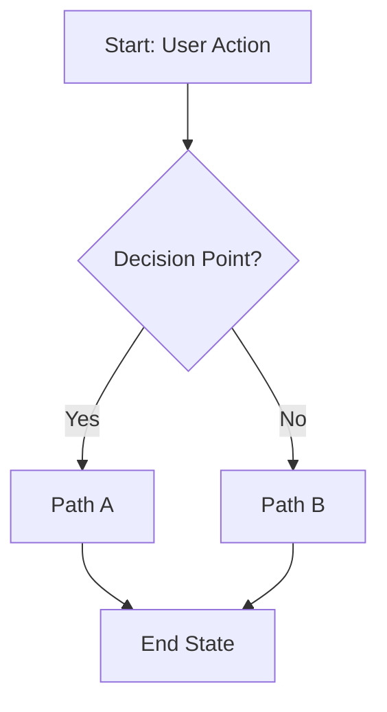
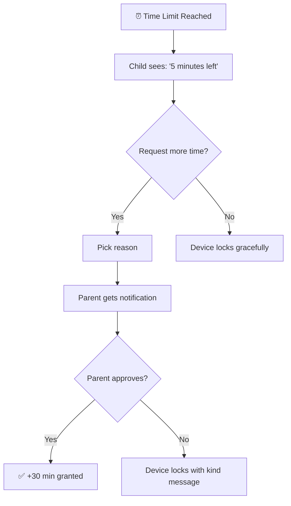
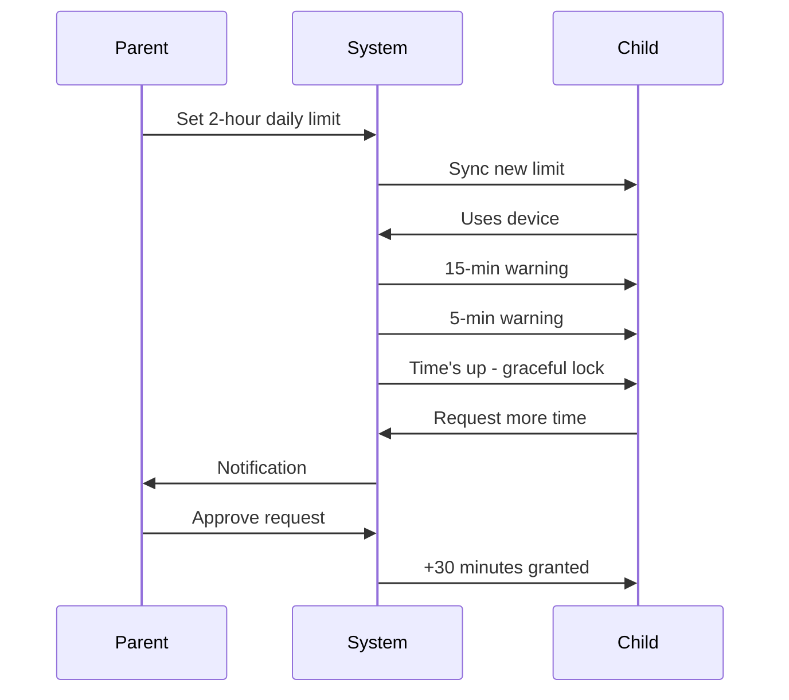
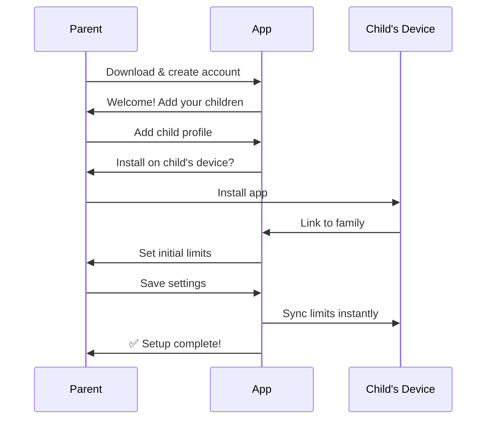
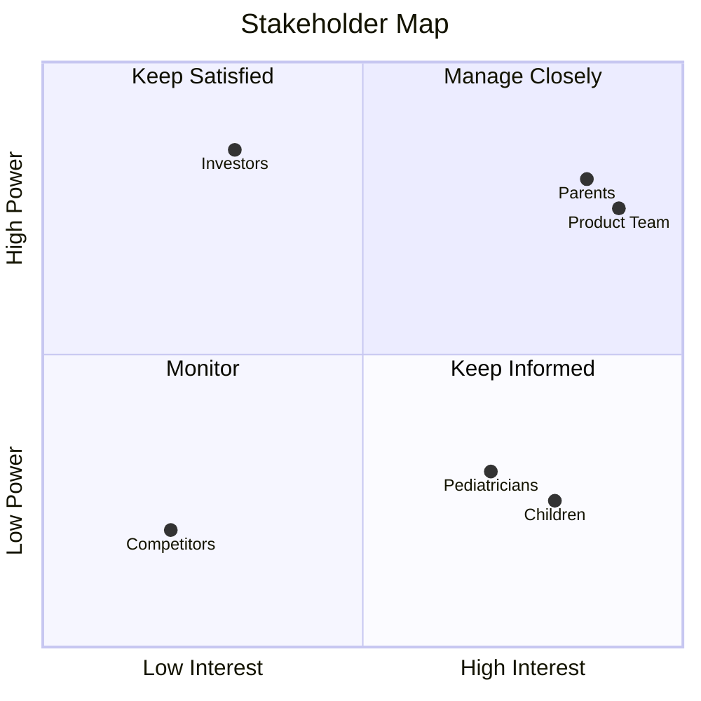
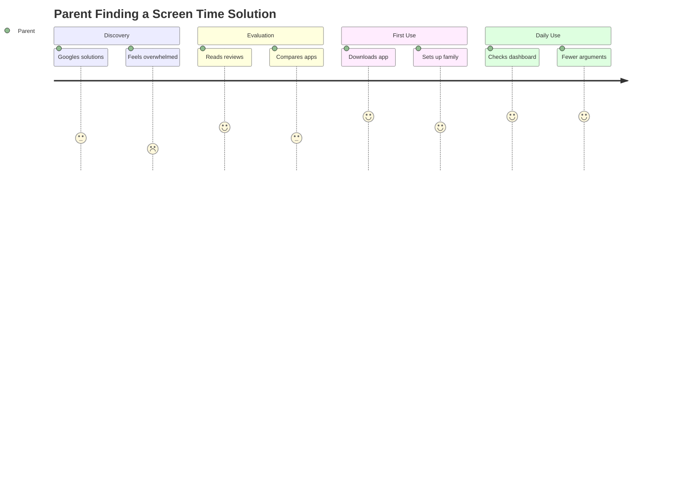
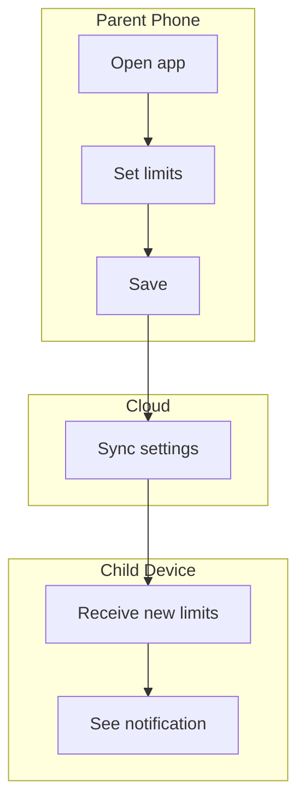

# Diagram Templates for Product Vision Documents

**Prefer Mermaid diagrams** — they render consistently across GitHub, Notion, VS Code, and most documentation tools. Use ASCII as fallback when Mermaid can't represent the layout.

## Flowchart (Mermaid) — User Workflows

Use for showing step-by-step processes with decision points.



### Example: Child Requests More Time



## Sequence Diagram (Mermaid) — Actor Interactions

Use for showing how different actors interact over time.



### Example: Parent Onboarding Flow



## Quadrant Chart (Mermaid) — Stakeholder Maps

Use for Power-Interest grids and similar 2x2 matrices.



## User Journey (Mermaid)

Use for showing emotional experience across touchpoints.



## Flowchart with Subgraphs — Complex Workflows

Use when showing multiple actors in parallel.



---

## ASCII Fallback Templates

Use ASCII when Mermaid can't represent the layout or when you need more visual control.

### Swimlane Diagram (ASCII)

For complex multi-actor flows that need precise alignment:

```
┌─────────────────────────────────────────────────────────────────────────────┐
│                           [PROCESS NAME]                                    │
├─────────────────────────────────────────────────────────────────────────────┤
│                                                                             │
│  [ACTOR 1]    ──►[Action]──►[Action]──────────────────►[End State]         │
│                      │                                      ▲               │
│                      ▼                                      │               │
│  [ACTOR 2]         [Action]──►[Decision?]──►[Action]───────┘               │
│                                    │                                        │
│                                    ▼ (alternative)                          │
│  [SYSTEM]                      [Action]──►[Notification]                   │
│                                                                             │
└─────────────────────────────────────────────────────────────────────────────┘
```

### Power-Interest Grid (ASCII)

When you need more text in each quadrant than Mermaid allows:

```
                          INTEREST IN PRODUCT
                    Low                        High
                ┌─────────────────────┬─────────────────────┐
                │                     │                     │
           High │  KEEP SATISFIED     │  MANAGE CLOSELY     │
                │  • Investors        │  • Parents (buyers) │
                │  • App store teams  │  • Product team     │
     POWER      │                     │  • Early adopters   │
                ├─────────────────────┼─────────────────────┤
           Low  │  MONITOR            │  KEEP INFORMED      │
                │  • General public   │  • Children (users) │
                │  • Competitors      │  • Pediatricians    │
                └─────────────────────┴─────────────────────┘
```

### Simple System Overview (ASCII)

For showing user-visible components:

```
┌─────────────────────────────────────────────────────────────────────────────┐
│                           HOW IT WORKS                                      │
├─────────────────────────────────────────────────────────────────────────────┤
│                                                                             │
│    ┌───────────────┐                         ┌───────────────┐              │
│    │   📱 Parent   │                         │  📱 Child's   │              │
│    │   Phone       │                         │    Device     │              │
│    │               │      ┌─────────┐        │               │              │
│    │ • View usage  │◄────►│ ☁️ Cloud │◄──────►│ • See limits  │              │
│    │ • Set rules   │      │ (Secure)│        │ • Track time  │              │
│    │ • Approve     │      └─────────┘        │ • Request     │              │
│    └───────────────┘                         └───────────────┘              │
│                                                                             │
│    Changes sync instantly across all family devices                         │
└─────────────────────────────────────────────────────────────────────────────┘
```

---

## When to Choose Each Format

| Scenario | Use Mermaid | Use ASCII |
|----------|-------------|-----------|
| Simple flowchart | ✅ `flowchart` | |
| Actor interactions | ✅ `sequenceDiagram` | |
| User journey with emotions | ✅ `journey` | |
| 2x2 matrix with few points | ✅ `quadrantChart` | |
| 2x2 matrix with detailed lists | | ✅ Grid template |
| Complex swimlane with precise alignment | | ✅ Swimlane template |
| System overview with icons | | ✅ Box diagram |
| Decision tree | ✅ `flowchart` | |

## Tips for Creating Diagrams

### Do:
- Use simple, descriptive labels
- Show the user's perspective, not technical internals
- Include start and end states
- Keep diagrams under 10-12 nodes for readability
- Use emoji sparingly for visual interest in ASCII (📱 ✅ ⏰)

### Don't:
- Show technical architecture (databases, servers, APIs)
- Use technical abbreviations without explanation
- Create diagrams so complex they need explanation
- Rely on color alone to convey meaning

### Accessibility:
- Mermaid renders with good contrast by default
- ASCII diagrams use text that screen readers can parse
- Always provide text descriptions alongside complex diagrams
