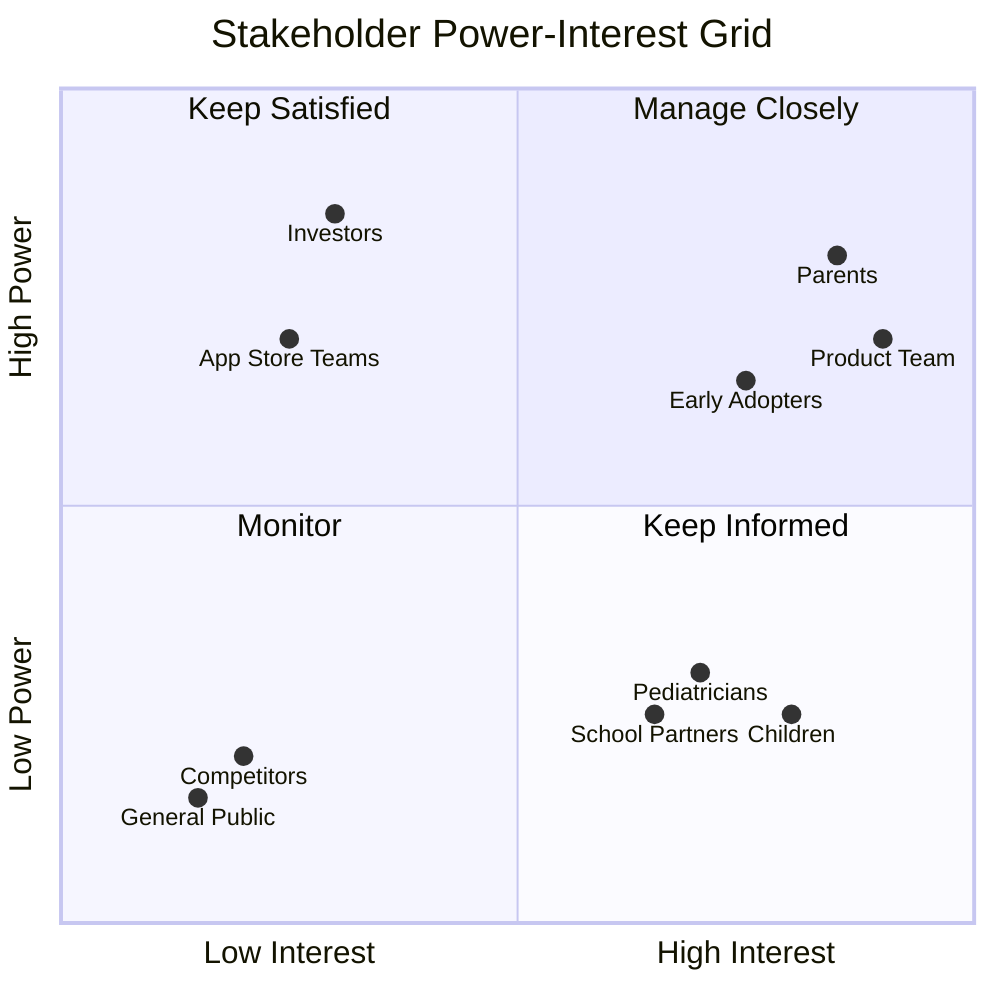
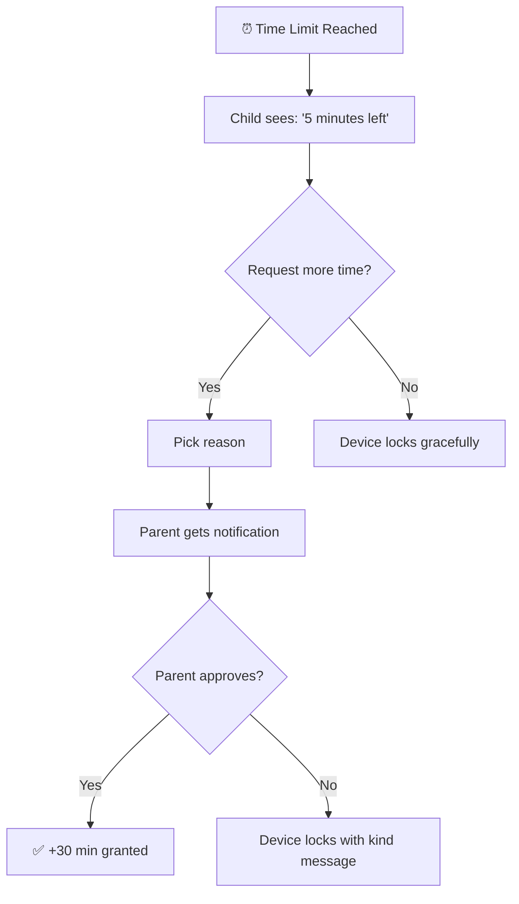

# Example: ScreenTime Guardian Product Vision Document

This is a complete example showing all required sections from the product-vision-document skill applied to a family screen time management app.

---

## 1. Vision Statement

**For** busy parents **who** struggle to manage their children's screen time without constant conflict, **the** ScreenTime Guardian **is a** family wellness app **that** creates healthy digital boundaries through collaboration. **Unlike** surveillance-focused competitors, **our product** teaches children self-regulation while giving parents peace of mind.

---

## 2. Problem Statement

| Element | Description |
|---------|-------------|
| **Who feels the pain** | Parents of children ages 5-16, particularly working parents with limited time for monitoring |
| **What the pain is** | No visibility into device usage, daily arguments at bedtime, rules feel arbitrary to children, parents feel like the "bad guy" |
| **Why it matters** | Damaged relationships, family stress, children developing unhealthy habits, parental guilt |
| **Current workarounds** | Taking devices away (causes tantrums), kitchen timers (ignored), built-in limits (kids know passcode), verbal warnings (arguments) |

---

## 3. Stakeholder Map

---

## 4. User Personas (JTBD Format)

### Persona: Sarah (Working Mom)

**Situation:** Two kids (8 and 12), limited energy after work for screen time battles

**Job to be Done:** 
When I come home from work exhausted, I want to know my kids stayed within healthy limits, so I can enjoy quality time instead of fighting about devices.

**Functional needs:** Set-and-forget limits
**Emotional needs:** Feel like a good parent, not a warden
**Social needs:** Be seen as balanced, not controlling

**Current alternatives:** Apple Screen Time (kids know passcode)
**Why alternatives fail:** Requires constant vigilance

---

## 5. User Workflow: Child Requests More Time

---

## 6. Use Cases

### Use Case: Set Daily Time Limits

**Actor:** Parent
**Goal:** Create consistent screen time rules
**Trigger:** Parent wants to establish healthy boundaries

**Main Flow:**
1. Parent opens app and selects child's profile
2. Parent adjusts daily limit slider (e.g., 2 hours)
3. Parent chooses which days this applies
4. Parent taps "Save"
5. Child's device updates instantly
6. Child sees notification: "Your daily limit is 2 hours"

**Alternative Flows:**
- If different limits for different apps → mark educational apps as unlimited

**Success Criteria:** Child understands limits; parent feels rules are enforced

---

## 7. Feature Overview

| What Users Can Do | Why It Matters | Who Benefits |
|-------------------|----------------|--------------|
| Set daily time limits | Consistent rules | Parents |
| 15/5-minute warnings | No surprise lockouts | Children |
| Request more time | Children have agency | Children |
| Earn bonus time | Positive reinforcement | Children |
| Weekly summaries | Stay informed | Parents |

---

## 8. Success Metrics

**User Success:**
- 50% reduction in screen time arguments (first month)
- 80%+ child compliance rate
- Parent checks app less than once daily

**Business Success:**
- 100,000 downloads (Year 1)
- 15% paid conversion
- 4.5+ star rating

---

## 9. Competitive Positioning

| | ScreenTime Guardian | Apple Screen Time | Bark |
|---|---|---|---|
| Cross-platform | ✓ | ✗ | ✓ |
| Earn bonus time | ✓ | ✗ | ✗ |
| Gentle warnings | ✓ | ✗ | N/A |
| No surveillance | ✓ | ✓ | ✗ |

**Why families choose us:** Teaching self-regulation, not surveillance. Parents become allies, not wardens.
