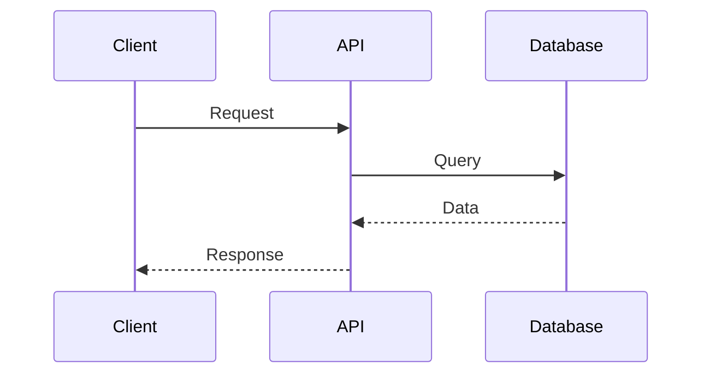
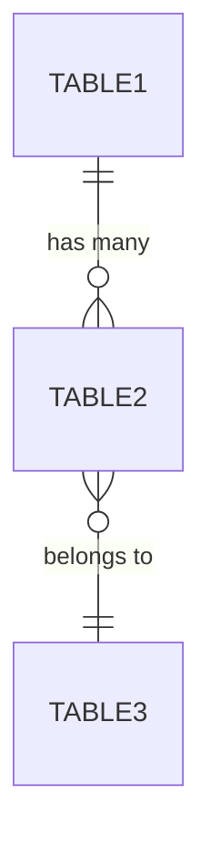
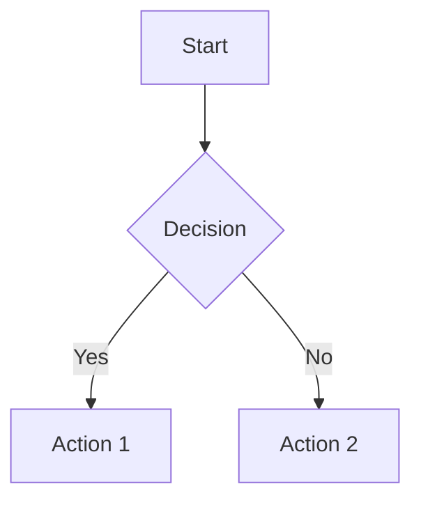

# Writing Technical Design Documents

## Overview

Help turn complex technical ideas into comprehensive, well-structured Technical Design Documents (TDDs) through collaborative dialogue. TDDs provide detailed technical specifications for significant features or system changes, serving as the blueprint for implementation and facilitating cross-team alignment.

## When to Use

**Use this skill when:**

- Designing features that span multiple services or systems
- Making significant architecture or data model changes
- Creating new APIs or modifying existing ones
- Work requires cross-team coordination or stakeholder buy-in
- Implementation timeline exceeds 2+ weeks
- Technical decisions need documentation for future reference
- Project needs clear RACI (Responsible, Accountable, Consulted, Informed) definition

**Don't use for:**

- Simple bug fixes or trivial features
- Internal implementation details for small changes
- Prototypes or experimental work
- Emergency hotfixes

## The Interactive Process

### Phase 1: Understanding Context

Start by exploring the current state and gathering requirements:

- **Review existing systems**: Check current architecture, related services, data models
- **Understand motivation**: What problem are we solving? Why now?
- **Identify stakeholders**: Who needs to be involved? Who will this impact?
- **Clarify scope**: What's in scope? What's explicitly out of scope?

**Ask questions one at a time** to understand:

- Business motivation and goals
- Technical constraints and dependencies
- Success criteria and non-goals
- Timeline expectations

### Phase 2: Exploring Approaches

Once context is clear, explore solution approaches:

- **Propose 2-3 alternatives** with trade-offs clearly articulated
- Present options conversationally with your recommendation
- Lead with your recommended approach and explain reasoning
- Consider: complexity, maintainability, performance, team expertise

**Discuss:**

- Data modeling strategies
- API design patterns
- Infrastructure requirements
- Migration/rollout strategies
- Testing approaches

### Phase 3: Developing the Design

Present the technical design in digestible sections (200-300 words each):

1. **High-level proposal** with system boundaries
2. **Data models** with schema definitions and relationships
3. **API definitions** (protobuf, REST, etc.)
4. **Sequence diagrams** showing component interactions
5. **Infrastructure** and deployment considerations
6. **Testing strategy** and quality assurance
7. **Risks** and mitigation strategies
8. **Timeline** and milestones

**After each section**: Ask "Does this approach look right so far?" Be ready to iterate and clarify.

### Phase 4: Documentation

Write the complete TDD to `docs/plans/YYYY-MM-DD-<topic>-tdd.md` using the structure found in template.md:

**Required sections:**

- Summary (with Terms glossary if needed)
- Motivation (Goals, Non-Goals)
- RACI Table
- Proposal (with architecture diagrams)
- Design & Implementation
  - External Dependencies
  - Data Model (with schemas, ER diagrams)
  - API definitions (inline protobuf/OpenAPI)
  - Infrastructure requirements
  - Testing Strategy
  - Development/Rollout Plan
- Risks (if applicable)
- Milestones & Timeline

**Commit the TDD** to git with descriptive message.

## Key Principles

### Collaborative Development

- **One question at a time** - Don't overwhelm with multiple questions
- **Multiple choice when possible** - Makes decisions easier
- **Incremental validation** - Present design in sections, validate each
- **Visual communication** - Use Mermaid diagrams liberally (sequence, ER, flowchart)
- **Be flexible** - Go back and revise when something doesn't work

### Documentation Quality

- **Comprehensive but focused** - Cover all aspects without unnecessary detail
- **RACI clarity** - Make accountability explicit upfront
- **Inline technical specs** - Include protobuf, SQL, API definitions directly in document
- **Architecture diagrams** - Use Mermaid for sequence flows, system boundaries, data relationships
- **Explicit non-goals** - State what you're NOT doing to prevent scope creep

### Technical Rigor

- **Consider dependencies** - External systems, services, timelines
- **Performance analysis** - Include latency expectations, load considerations
- **Migration strategy** - How to get from current state to proposed state
- **Testing requirements** - Unit, integration, manual QA needs
- **Rollout plan** - Feature flags, phased deployment, buyoff criteria

## Template Structure

Use the template.md file as a template when writing out new Technical Design Documents.

## Common Patterns

### Use Mermaid Diagrams

**Sequence diagrams** for API interactions:



**ER diagrams** for data relationships:



**Flowcharts** for decision logic:



### Inline Technical Specifications

**Include schemas directly** (SQL, MongoDB, etc.):

```sql
CREATE TABLE users (
    id bigint GENERATED BY DEFAULT AS IDENTITY PRIMARY KEY,
    email varchar(255) UNIQUE NOT NULL,
    created_at timestamp with time zone DEFAULT NOW()
);
```

**Include API definitions** (protobuf, OpenAPI):

```proto
message CreateUserRequest {
    string email = 1;
    string name = 2;
}

message CreateUserResponse {
    int64 user_id = 1;
}

service UserService {
    rpc CreateUser(CreateUserRequest) returns (CreateUserResponse);
}
```

### Performance Considerations

When describing endpoints/features, include:

- Expected latency (p95, p99)
- Load characteristics
- Comparison to similar existing endpoints
- User tolerance expectations

### Migration Strategy

For changes to existing systems:

- Current state description
- Step-by-step migration plan
- Backwards compatibility approach
- Data migration strategy
- Rollback plan

## Common Mistakes

### Too Vague

❌ "We'll add an API endpoint"
✅ Include full protobuf definition with request/response types

### Missing Diagrams

❌ Describing complex interactions in prose
✅ Use Mermaid sequence diagrams to show component interactions

### Unclear Accountability

❌ "The team will handle this"
✅ RACI table with specific names/roles

### Ignoring Non-Goals

❌ Only listing what you're building
✅ Explicitly state what's out of scope

### No Risk Analysis

❌ Assuming everything will go smoothly
✅ Identify risks and mitigation strategies
