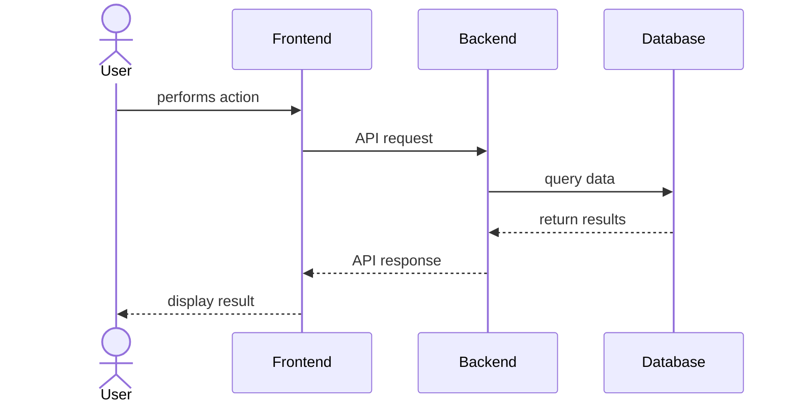
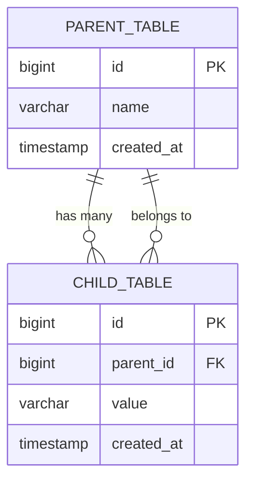

## Table of Contents

- [Summary](#summary)
  - [Terms](#terms)
- [Motivation](#motivation)
  - [Goals](#goals)
  - [Non-Goals](#non-goals)
- [RACI Table](#raci-table)
- [Proposal](#proposal)
- [Design & Implementation](#design--implementation)
  - [External Dependencies](#external-dependencies)
  - [Data Model](#data-model)
  - [API Definitions](#api-definitions)
  - [Infrastructure](#infrastructure)
  - [Testing Strategy](#testing-strategy)
  - [Development / Rollout Plan](#development--rollout-plan)
- [Risks](#risks)
- [Milestones & Timeline](#milestones--timeline)

## Summary

Brief 2-3 paragraph overview of what's being built and why. Should answer:

- What is this project?
- What problem does it solve?
- How does it solve it (high level)?

### Terms

- **Term 1**: Definition of domain-specific term or acronym
- **Term 2**: Definition of system name or technical concept
- **Service/System Abbreviation**: Full name and brief description

## Motivation

Explain the business and technical context. Why are we building this now?

### Goals

1. **Concrete, measurable goal 1**: Description of what success looks like
2. **Concrete, measurable goal 2**: Another specific objective
3. **Concrete, measurable goal 3**: What we aim to achieve

### Non-Goals

1. **What we're NOT doing 1**: Explicitly state scope boundaries
2. **What we're NOT doing 2**: Helps prevent feature creep
3. **Future work**: Note items intentionally deferred

## RACI Table

<!-- rumdl-disable MD013 -->

| Aspect / Goal              | Responsible (R) | Accountable (A) | Consulted (C)      | Informed (I)      |
| -------------------------- | --------------- | --------------- | ------------------ | ----------------- |
| Goal 1 or technical aspect | @person         | @person         | @person1, @person2 | Team, Stakeholder |
| Goal 2 or technical aspect | @person         | @person         | @person1, @person2 | Team, Stakeholder |

<!-- rumdl-enable MD013 -->

## Proposal

High-level description of the proposed solution. Include:

- System boundaries
- Key components
- Main user flows
- Architecture overview



## Design & Implementation

### External Dependencies

List all external systems, services, or projects this depends on:

- **System/Service Name**: What it provides, expected availability timeline
- **External API**: Version, endpoints needed
- **Other Team's Project**: What's needed, coordination required

### Data Model

#### Schema Definition

```sql
CREATE TABLE example_table (
    id bigint GENERATED BY DEFAULT AS IDENTITY PRIMARY KEY,
    name varchar(255) NOT NULL,
    description text,
    created_at timestamp with time zone NOT NULL DEFAULT NOW(),
    updated_at timestamp with time zone NOT NULL DEFAULT NOW()
);

CREATE INDEX example_name_idx ON example_table (name);
```

#### Entity Relationships



### API Definitions

Include protobuf, REST API specifications, or other interface definitions:

```proto
// Models

message ExampleModel {
    int64 id = 1;
    string name = 2;
    google.protobuf.Timestamp created_at = 3;
}

// Request/Response

message CreateExampleRequest {
    string name = 1;
    optional string description = 2;
}

message CreateExampleResponse {
    ExampleModel example = 1;
}

message ListExamplesRequest {
    optional string filter = 1;
    int32 page_size = 2;
    string page_token = 3;
}

message ListExamplesResponse {
    repeated ExampleModel examples = 1;
    string next_page_token = 2;
}

// Service

service ExampleService {
    rpc CreateExample(CreateExampleRequest) returns (CreateExampleResponse);
    rpc ListExamples(ListExamplesRequest) returns (ListExamplesResponse);
}
```

#### Endpoint Performance Analysis

If introducing new endpoints or modifying existing ones:

- **Expected latency**: p95 latency target (e.g., ~100ms)
- **Comparison**: Similar existing endpoint has p95 of Xms
- **User tolerance**: Single-digit second response acceptable for this use case
- **Load characteristics**: Expected QPS, peak usage patterns

### Infrastructure

Describe infrastructure needs:

- **New services**: None required / New service needed with X replicas
- **Database changes**: Migrations, new tables, indexes
- **Monitoring**: Metrics to track, dashboards to create
- **Alerts**: SLOs, error rate thresholds
- **Deployment**: K8s, serverless, containerization approach

### Testing Strategy

#### Unit Testing

- Coverage expectations
- Key scenarios to test
- Mock/stub approach

#### Integration Testing

- Service interaction testing
- Database integration tests
- External API mocking strategy

#### Manual QA / Buyoff

- User acceptance criteria
- Stakeholder validation requirements
- Cross-verification with existing systems (if applicable)

### Development / Rollout Plan

Phases and milestones for implementation:

**Phase 1: Foundation** (~X weeks)

1. Database schema and migrations
2. Core API implementation
3. Unit test coverage

**Phase 2: Integration** (~X weeks)

1. Frontend integration
2. External system integration
3. Integration testing

**Phase 3: Rollout** (~X weeks)

1. Feature flag implementation
2. Staged rollout (internal → beta → production)
3. Monitoring and validation
4. Documentation updates

**Feature Flags:**

- `enable_feature_x` - Gates entire feature
- `enable_experimental_behavior` - For testing new approaches

**Buyoff Criteria:**

- All tests passing
- Manual QA completed
- Performance meets expectations
- Stakeholder approval

## Risks

Identify potential issues and mitigation strategies:

| Risk                           | Impact | Probability | Mitigation Strategy                     |
| ------------------------------ | ------ | ----------- | --------------------------------------- |
| External dependency delays     | High   | Medium      | Regular check-ins, fallback plan        |
| Performance below expectations | Medium | Low         | Load testing early, optimization buffer |
| Data migration complexity      | High   | Medium      | Thorough testing, rollback plan         |

## Milestones & Timeline

<!-- rumdl-disable MD013 -->

| Milestone & Features         | Phase       | Estimates | Timeline | Dependencies          |
| ---------------------------- | ----------- | --------- | -------- | --------------------- |
| Database schema & migrations | Foundation  | 3 days    | Week 1   | None                  |
| Core API implementation      | Foundation  | 1 week    | Week 2   | Database complete     |
| Frontend integration         | Integration | 1.5 weeks | Week 3-4 | API complete          |
| Testing & QA                 | Rollout     | 1 week    | Week 5   | All features complete |
| Production rollout           | Rollout     | 0.5 weeks | Week 6   | QA signoff            |

<!-- rumdl-enable MD013 -->

**Total Estimate:** ~6 weeks
